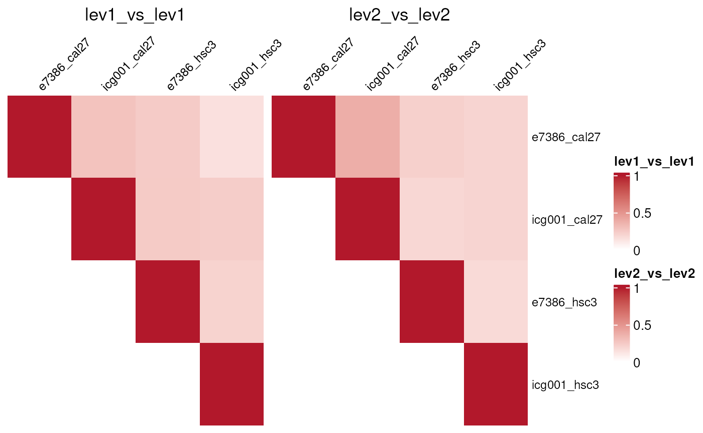
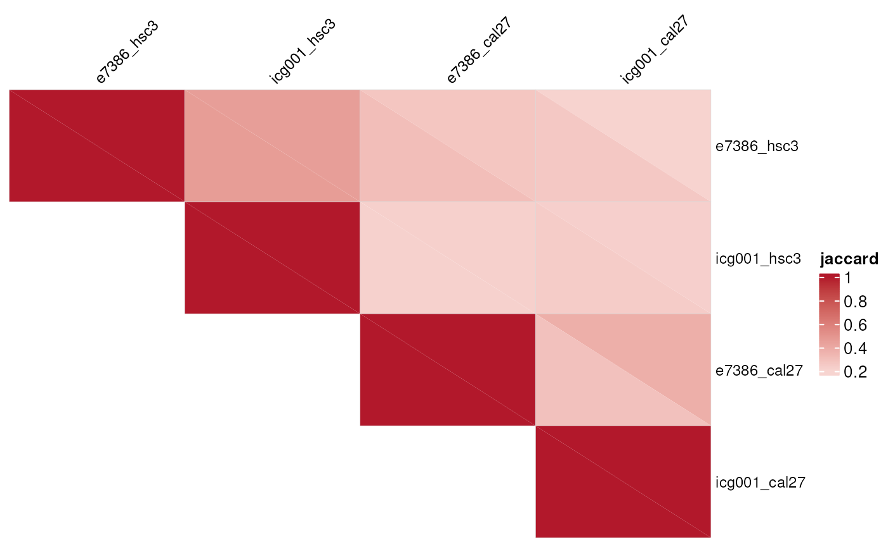
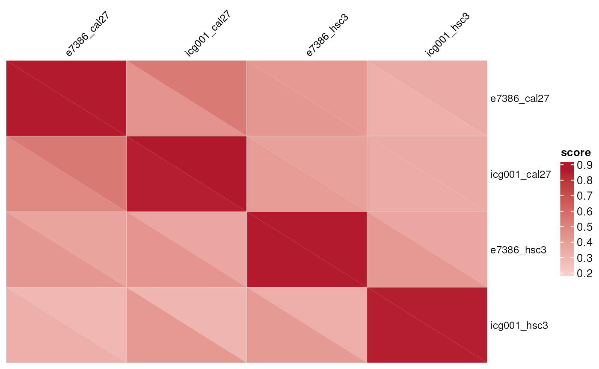
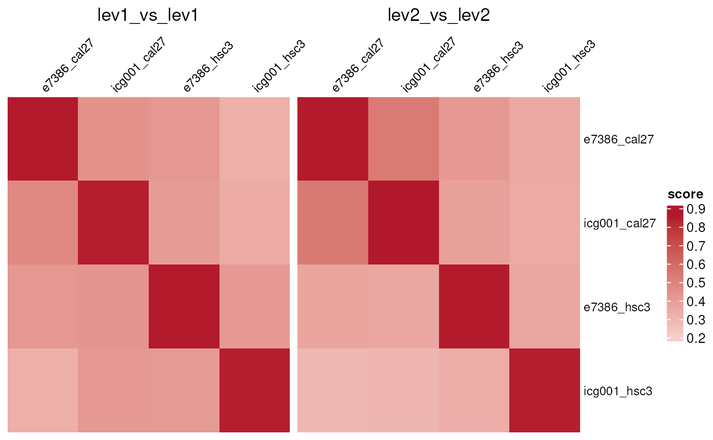

# Comparing OmicSignature Lists

This vignette outlines the workflow for comparing `OmicSignature`
objects and visualizing similarity among signatures.

## Compare one list of signatures

Use
[`compare_omic_signatures()`](https://montilab.github.io/OmicSignature/reference/compare_omic_signatures.md)
with a named list of `OmicSignature` objects to compare every signature
against every other signature in the list. For bi-directional
signatures, the function compares the first factor level against the
first factor level and the second factor level against the second factor
level.

``` r

library(OmicSignature)

data(compare_signatures_example)
signature_list <- compare_signatures_example

overlap_res <- compare_omic_signatures(
  sig_list1 = signature_list,
  method = "overlap",
  score_cutoff = log2(1.25),
  adj_p_cutoff = 0.05,
  min_features = 25,
  max_feature = 2000
)
## show the label order
overlap_res$label_order
#> $sig_list1
#>              level1 level2  
#> e7386_hsc3   "DMSO" "E7386" 
#> e7386_cal27  "DMSO" "E7386" 
#> icg001_hsc3  "DMSO" "ICG001"
#> icg001_cal27 "DMSO" "ICG001"

## list the comparisons being performed
names(overlap_res$comparisons)
#> [1] "level1_vs_level1" "level2_vs_level2"

## show the comparison results for level 1 (jaccard and counts)
overlap_res$comparisons$level1_vs_level1$jaccard
#>              e7386_hsc3 e7386_cal27 icg001_hsc3 icg001_cal27
#> e7386_hsc3    1.0000000   0.3023088   0.4600457    0.2535613
#> e7386_cal27   0.3023088   1.0000000   0.2141944    0.2862150
#> icg001_hsc3   0.4600457   0.2141944   1.0000000    0.2384770
#> icg001_cal27  0.2535613   0.2862150   0.2384770    1.0000000

## in the counts matrix, you can see the signature sizes in the diagonal
overlap_res$comparisons$level1_vs_level1$counts
#>              e7386_hsc3 e7386_cal27 icg001_hsc3 icg001_cal27
#> e7386_hsc3         1232         419         806          356
#> e7386_cal27         419         573         335          245
#> icg001_hsc3         806         335        1326          357
#> icg001_cal27        356         245         357          528
```

The overlap method returns three matrices for each compared factor
level:

- `jaccard`: Jaccard similarity between retained feature sets.
- `pvalue`: Fisher exact test p-values for overlap enrichment.
- `counts`: an integer matrix with the same dimensions as
  `jaccard`/`pvalue`. Entry `[i, j]` is the overlap size between
  signature `i` and signature `j`; for self-comparisons, the diagonal is
  therefore each signature’s own retained feature-set size.

## Compare two lists of signatures

Pass both `sig_list1` and `sig_list2` to compare signatures across
collections. This is useful when signatures come from different studies,
cohorts, platforms, or perturbation screens.

``` r

reference_signatures <- compare_signatures_example[1:2]
query_signatures <- compare_signatures_example[3:4]

cross_res <- compare_omic_signatures(
  sig_list1 = query_signatures,
  sig_list2 = reference_signatures,
  method = "overlap",
  score_cutoff = log2(1.25),
  adj_p_cutoff = 0.05,
  min_features = 25,
  max_feature = 500
)

cross_res$comparisons$level1_vs_level1$jaccard
#>              e7386_hsc3 e7386_cal27
#> icg001_hsc3   0.2048193   0.1415525
#> icg001_cal27  0.2437811   0.2804097
```

When `background` is not supplied, the feature universe is inferred from
all available signature and differential-expression tables in both
inputs. Supplying a measured or assay-specific background is recommended
when it is available.

## Control label pairing

By default, level ordering follows the factor levels in each signature’s
`group_label` column. Use `label_pairing` and `label_pairing2` when
signatures need explicit matching.

``` r

data(compare_label_pairing_example)

## let's see the order of the signatures' group_label's
compare_label_pairing_example |>
  sapply(\(x) levels(x$difexp$group_label)) |> t() |>
  as.data.frame() |> setNames(c("level1", "level2"))
#>                level1    level2
#> signature_a   treated   control
#> signature_b      down        up
#> signature_c resistant sensitive

## compare signatures and provide the desired label pairing
paired_res <- compare_omic_signatures(
  sig_list1 = compare_label_pairing_example,
  method = "overlap",
  label_pairing = list(
    signature_a = c("treated", "control"),
    signature_b = c("up", "down"),
    signature_c = c("resistant", "sensitive")
  )
)
## level1 vs. level1
paired_res$comparisons$level1_vs_level1$jaccard
#>             signature_a signature_b signature_c
#> signature_a   1.0000000   0.6666667   0.3333333
#> signature_b   0.6666667   1.0000000   0.3333333
#> signature_c   0.3333333   0.3333333   1.0000000

## level2 vs. level2
paired_res$comparisons$level2_vs_level2$jaccard
#>             signature_a signature_b signature_c
#> signature_a   1.0000000   0.6666667   0.3333333
#> signature_b   0.6666667   1.0000000   0.3333333
#> signature_c   0.3333333   0.3333333   1.0000000
```

## KS and GSEA-style comparisons

The `ks_rank`, `ks_score`, and `gsea` methods compare a retained feature
set from one signature against ranked differential-expression scores
from another signature. These methods require the compared
`OmicSignature` objects to retain their `difexp` tables. For each
requested `group_label`, genes are ranked from the largest
`-log10(p_value)` in that label to the largest `-log10(p_value)` in the
contrasting label. `ks_rank` tests where the retained features fall in
that ranking, while `ks_score` compares their numeric ranking scores
against the remaining features. The legacy `method = "ks"` name is
accepted as an alias for `method = "ks_rank"`.

``` r

ks_res <- compare_omic_signatures(
  sig_list1 = signature_list,
  method = "ks_rank",
  adj_p_cutoff = 0.05,
  min_features = 25,
  max_feature = 500
)

ks_res$comparisons$level1_vs_level1$score
#>              e7386_hsc3 e7386_cal27 icg001_hsc3 icg001_cal27
#> e7386_hsc3    0.8592342   0.4160968   0.4107636    0.4287572
#> e7386_cal27   0.4201126   0.8589527   0.3174991    0.4384881
#> icg001_hsc3   0.4059002   0.3219889   0.8509243    0.4114431
#> icg001_cal27  0.4019190   0.4744036   0.3374776    0.8509243
ks_res$comparisons$level1_vs_level1$pvalue
#>              e7386_hsc3 e7386_cal27 icg001_hsc3 icg001_cal27
#> e7386_hsc3            0           0           0            0
#> e7386_cal27           0           0           0            0
#> icg001_hsc3           0           0           0            0
#> icg001_cal27          0           0           0            0
```

The simulated label-pairing data can also be compared with `ks_score`.
In this toy example, the treated/up/resistant labels define the first
level and the control/down/sensitive labels define the second level.

``` r

toy_ks_score <- compare_omic_signatures(
  sig_list1 = compare_label_pairing_example,
  method = "ks_score",
  label_pairing = list(
    signature_a = c("treated", "control"),
    signature_b = c("up", "down"),
    signature_c = c("resistant", "sensitive")
  ),
  min_features = 5
)

round(toy_ks_score$comparisons$level1_vs_level1$score, 3)
#>             signature_a signature_b signature_c
#> signature_a         1.0         0.8       0.556
#> signature_b         0.8         1.0       0.556
#> signature_c         0.5         0.5       1.000

signif(toy_ks_score$comparisons$level1_vs_level1$pvalue, 3)
#>             signature_a signature_b signature_c
#> signature_a    5.78e-14    2.83e-10    6.24e-04
#> signature_b    2.83e-10    5.78e-14    6.24e-04
#> signature_c    1.03e-03    3.44e-05    5.78e-14

round(toy_ks_score$comparisons$level2_vs_level2$score, 3)
#>             signature_a signature_b signature_c
#> signature_a         1.0         0.8         0.5
#> signature_b         0.8         1.0         0.5
#> signature_c         0.5         0.5         1.0

signif(toy_ks_score$comparisons$level2_vs_level2$pvalue, 3)
#>             signature_a signature_b signature_c
#> signature_a    5.78e-14    2.83e-10    6.27e-04
#> signature_b    2.83e-10    5.78e-14    6.27e-04
#> signature_c    3.44e-05    1.61e-03    5.78e-14
```

GSEA requires the optional `fgsea` package.

``` r

gsea_res <- compare_omic_signatures(
  sig_list1 = signature_list,
  method = "gsea",
  adj_p_cutoff = 0.05,
  min_features = 25,
  max_feature = 500,
  minSize = 10,
  maxSize = 500
)
```

## Plot similarity heatmaps

Use
[`signature_similarity_heatmap()`](https://montilab.github.io/OmicSignature/reference/signature_similarity_heatmap.md)
to visualize square self-comparison output from
`compare_omic_signatures(method = "overlap")`. The heatmap function
requires the optional `ComplexHeatmap` and `circlize` packages.

``` r

signature_similarity_heatmap(
  overlap_res,
  measure = "jaccard",
  mode = "separate",
  triangle = "upper",
  column_names_gp = grid::gpar(fontsize = 9),
  row_names_gp = grid::gpar(fontsize = 9),
  column_names_rot = 45
)
```



With `mode="combined"`, a single triangular matrix is shown, with each
entry divided into two triangles displaying the level2 (top-right) and
level1 (bottom-left) similarity.

``` r

signature_similarity_heatmap(
  overlap_res,
  measure = "jaccard",
  mode = "combined",
  triangle = "upper",
  column_names_gp = grid::gpar(fontsize = 9),
  row_names_gp = grid::gpar(fontsize = 9),
  column_names_rot = 45
)
```



For `measure = "pvalue"`, values are plotted as `-log10(pvalue)`. Larger
values therefore indicate stronger overlap enrichment.

Rank-based KS and GSEA outputs can be visualized with
`measure = "score"` or `measure = "pvalue"`. Because these matrices are
directional rather than symmetric, `mode = "combined"` draws the full
square matrix (not just one triangle), splitting each cell into two
triangles that superimpose the two `mode = "separate"` matrices: the
bottom-left triangle shows `level1_vs_level1` and the top-right triangle
shows `level2_vs_level2`. `mode = "separate"` draws those same two
matrices as separate, full heatmaps instead.

``` r

signature_similarity_heatmap(
  ks_res,
  measure = "score",
  mode = "combined",
  triangle = "upper",
  column_names_gp = grid::gpar(fontsize = 9),
  row_names_gp = grid::gpar(fontsize = 9),
  column_names_rot = 45
)
```



``` r


signature_similarity_heatmap(
  ks_res,
  measure = "score",
  mode = "separate",
  column_names_gp = grid::gpar(fontsize = 9),
  row_names_gp = grid::gpar(fontsize = 9),
  column_names_rot = 45
)
```


