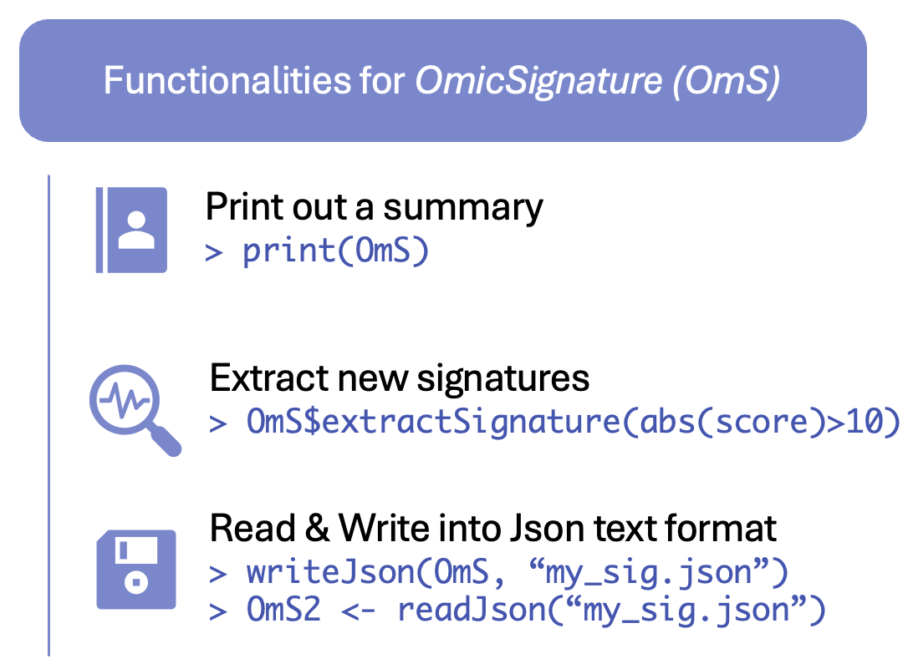

# Functionalities of OmicSignature

``` r

devtools::load_all(".")
```



## Read an `OmicSignature` object from a json file

Alternatively, you can read and write the object in `.rds` format as any
other R objects.

``` r

OmS <- readJson(file.path(system.file("extdata", package = "OmicSignature"), "Myc_reduce_mice_liver_24m_OmS.json"))
#>   [Success] OmicSignature object Myc_reduce_mice_liver_24m created.
```

## Write an `OmicSignature` object into a json file

    writeJson(OmS, "Myc_reduce_mice_liver_24m_OmS.json")

## Print and see the metadata

``` r

OmS
#> Signature Object: 
#>   Metadata: 
#>     adj_p_cutoff = 0.05 
#>     assay_type = transcriptomics 
#>     author = vmli 
#>     description = mice MYC reduced expression 
#>     direction_type = bi-directional 
#>     keywords = Myc, KO, longevity 
#>     organism = Mus musculus 
#>     others = C57BL/6 
#>     phenotype = Myc_reduce 
#>     platform = transcriptomics by array 
#>     PMID = 25619689 
#>     sample_type = liver 
#>     score_cutoff = 5 
#>     signature_name = Myc_reduce_mice_liver_24m 
#>     year = 2015 
#>   Metadata user defined fields: 
#>     animal_strain = C57BL/6 
#>   Signature: 
#>     MYC reduce (5)
#>     WT (10)
#>   Differential Expression Data: 
#>     884 x 10
```

## Extract new signatures from the `OmicSignature` object

We can use new criterias to extract new signatures conveniently from the
OmicSignature Object, **if it has difexp matrix included**.  
For example, extract all features with a t-score with absolute value
higher than 5 and adj_p smaller than 0.01:

``` r

OmS$extractSignature("abs(score) > 5; adj_p < 0.01")
#>   probe_id       feature_name   score group_label
#> 1 10349648 ENSMUSG00000004552  14.762   treatment
#> 2 10345762 ENSMUSG00000026072 -13.543     control
#> 3 10353192 ENSMUSG00000025932  10.487   treatment
#> 4 10355259 ENSMUSG00000061816 -10.315     control
#> 5 10351477 ENSMUSG00000102418   8.818   treatment
```

## 
