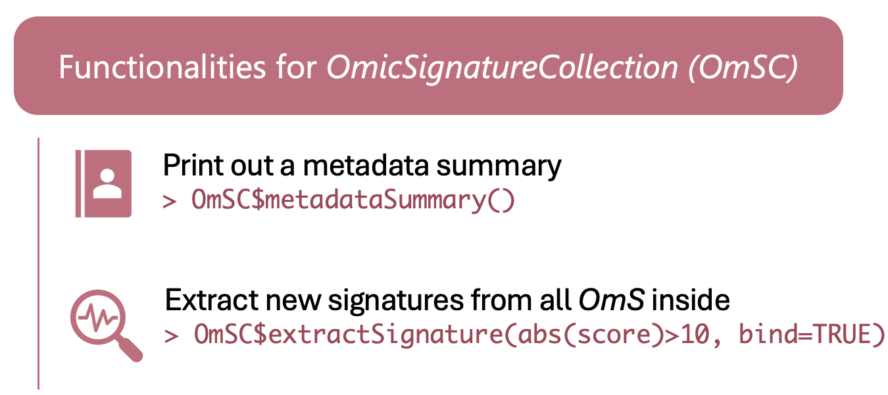

```{r, include = FALSE}
knitr::opts_chunk$set(
  collapse = TRUE,
  comment = "#>"
)
```

```{r message=FALSE, warning=FALSE}
devtools::load_all(".")
library(dplyr)
```
<font color = "#000000">

```{r echo=FALSE, out.height="60%", out.width="60%"}

```

First, create an `OmicSignatureCollection` object. \
This is the same code in ["Create OmicSignatureCollection"](https://montilab.github.io/OmicSignature/articles/CreateOmSC.html) section. \
The following signatures are pseudo results for illustration purpose. \
```{r}
OmS1 <- readJson(file.path(system.file("extdata", package = "OmicSignature"), "OmS_example_1.json"))
OmS2 <- readJson(file.path(system.file("extdata", package = "OmicSignature"), "OmS_example_2.json"))
OmS3 <- readJson(file.path(system.file("extdata", package = "OmicSignature"), "OmS_example_3.json"))
ColMeta <- list(
  "collection_name" = "OmS_example_Collection",
  "description" = "An example of signature collection",
  "organism" = "Mus Musculus",
  "author" = "vmli"
)
OmSC <- OmicSignatureCollection$new(
  OmicSigList = list(OmS1, OmS2, OmS3),
  metadata = ColMeta,
  print_message = FALSE
)
```

## Print a summary of the metadata in the `OmicSignatureCollection`  
`$metadataSummary()` will print out the metadata fields in all `OmicSignature` 
objects stored in the `OmicSignatureCollection`.  
When parameter "only_shared" is set to be `TRUE`, only shared metadata fields 
among all `OmicSignature` objects will be included. Otherwise, all metadata 
fields will be included.
```{r}
OmSC$metadataSummary(only_shared = TRUE)
```

## Extract new signatures from the `OmicSignatureCollection` object

For example, extract all features with a absolute score > 4.5 and p < 0.01 from all the `OmicSignature` object stored in this Collection. The features are ranked by absolute score, if applicable. 
```{r}
OmSC$extractSignature("abs(score) > 4.5 & p_value < 0.01")
```

If `bind` is set to be `FALSE`, the output of each `OmicSignature` objects are provided as a list. \
```{r}
OmSC$extractSignature("abs(score) > 4.5 & p_value < 0.01", bind = FALSE)
```

</font>
--
