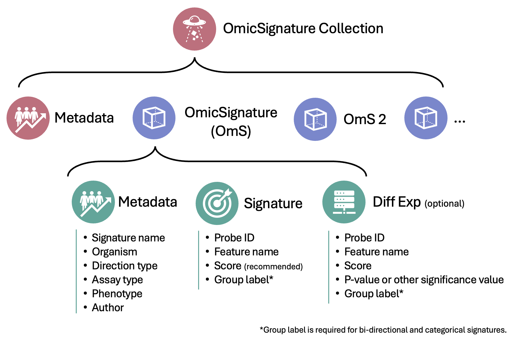
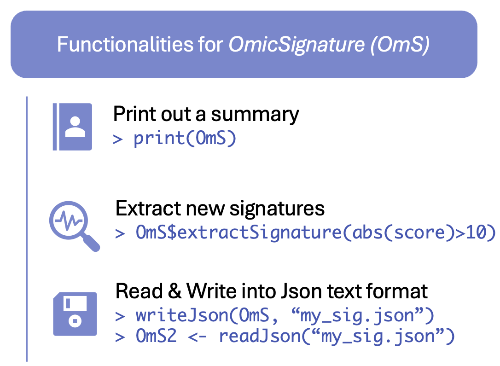

```{r, include = FALSE}
knitr::opts_chunk$set(
  collapse = TRUE,
  comment = "#>"
)
```

<font color = "#000000">

```{r echo=FALSE, out.height="90%", out.width="90%"}

```

## OmicSignature object structure
An `OmicSignature` object contains three parts:  
 - **metadata**, a list containing metadata fields;  
 - **signature**, a dataframe with the names, and directions and scores if applicable, of the "significant" features;  
 - **difexp**, optional, a dataframe with the complete differential expression analysis result.  

See [here](https://montilab.github.io/OmicSignature/articles/CreateOmS.html) for how to create one. 

## OmicSignatureCollection object structure
An `OmicSignatureCollection` object contains two parts:  
 - metadata, a list containing a collection's metadata fields;
 - OmicSigList, a list of OmicSignature Objects  

See [here](https://montilab.github.io/OmicSignature/articles/CreateOmSC.html) for how to create one. 

## Cheat-Sheet of main functionalities
```{r echo=FALSE, out.height="60%", out.width="60%"}

```

```{r echo=FALSE, out.height="60%", out.width="60%"}
knitr::include_graphics("figs/OmSC_function_2510.png")
```

--

</font>
