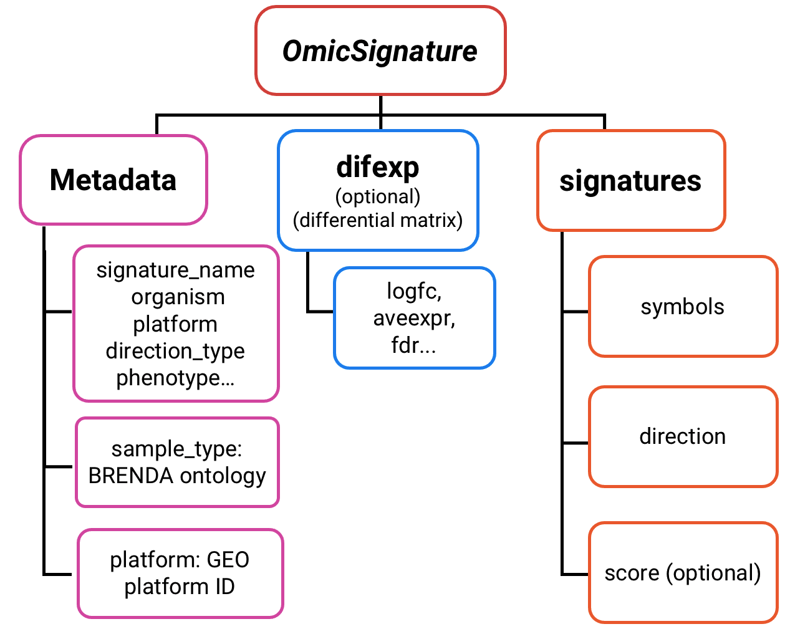
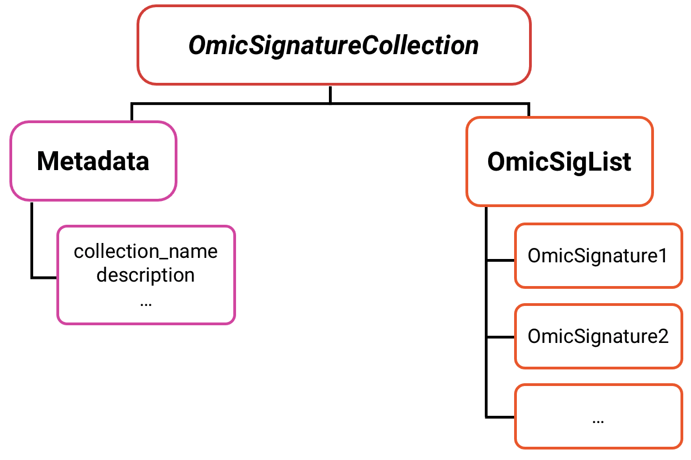

```{r, include = FALSE}
knitr::opts_chunk$set(
  collapse = TRUE,
  comment = "#>"
)
```

## Structure of OmicSignature object
An `OmicSignature` object contains three parts:  
 - **metadata**, a list contains metadata fields;  
 - **signature**, a dataframe with feature symbols and directions, and scores if applicable;  
 - **difexp**, optional, a dataframe from differential expression analysis result.  



## Structure of OmicSignatureCollection object
An `OmicSignatureCollection` object contains two parts:  
 - metadata  
 - OmicSigList, a list of OmicSignature Objects  




## Main functionalities


## Quick Cheat-Sheet of main functionalities


--

