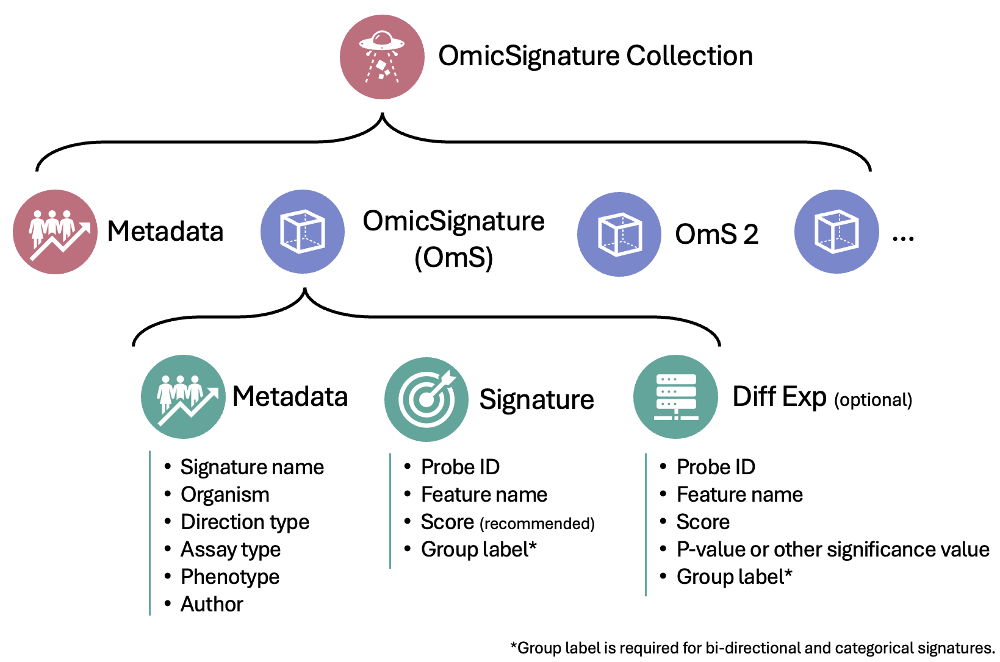
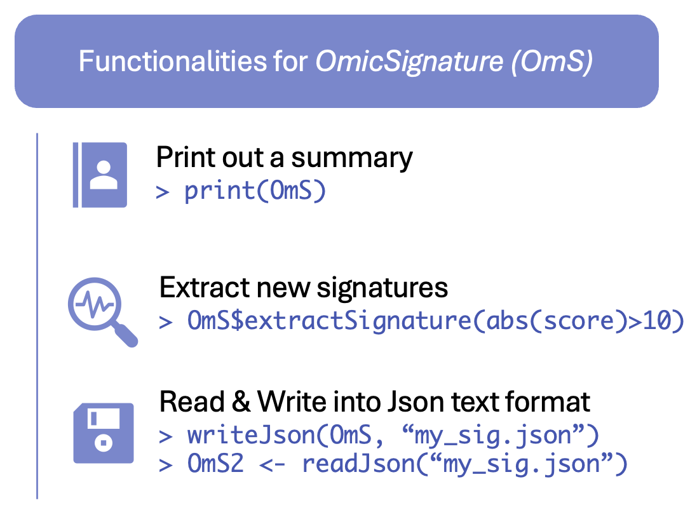
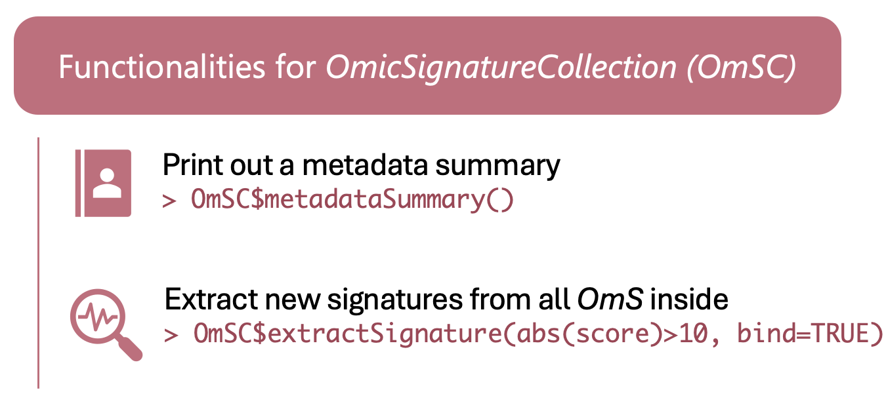

```{r, include = FALSE}
knitr::opts_chunk$set(
  collapse = TRUE,
  comment = "#>"
)
```

<font color = "#000000">

```{r echo=FALSE, out.height="90%", out.width="90%"}

```

## OmicSignature object structure
An `OmicSignature` is an R6 object. Unlike most base R objects, R6 objects use
reference semantics: assigning an `OmicSignature` to another variable does not
create an independent copy. Both variables point to the same mutable object, so
changes made through one variable are visible through the other. Use
`OmS_copy <- OmS$clone()` when you need an independent object, and use
`OmS$clone(deep = TRUE)` when nested R6 objects also need to be copied.

An `OmicSignature` object contains three parts:  
 - **metadata**, a list containing metadata fields;  
 - **signature**, a dataframe with the names, and directions and scores if applicable, of the "significant" features;  
 - **difexp**, optional, a dataframe with the complete differential expression analysis result.  

See [here](https://montilab.github.io/OmicSignature/articles/CreateOmS.html) for how to create one. 

## OmicSignatureCollection object structure
An `OmicSignatureCollection` is also an R6 object and follows the same
assignment-by-reference behavior. Use `$clone()` before modifying a collection
when you want to keep the original object unchanged.

An `OmicSignatureCollection` object contains two parts:  
 - metadata, a list containing a collection's metadata fields;
 - OmicSigList, a list of OmicSignature Objects  

See [here](https://montilab.github.io/OmicSignature/articles/CreateOmSC.html) for how to create one. 

## Cheat-Sheet of main functionalities
```{r echo=FALSE, out.height="60%", out.width="60%"}

```

```{r echo=FALSE, out.height="60%", out.width="60%"}

```

--

</font>
